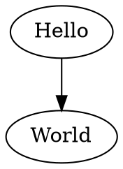

[](https://github.com/ts-graphviz/prettier-plugin-dot/actions?workflow=NodeCI)
[](https://badge.fury.io/js/prettier-plugin-dot)
[](https://opensource.org/licenses/MIT)
[](http://makeapullrequest.com)
[](https://github.com/facebook/jest)
[](https://github.com/prettier/prettier)<!-- ALL-CONTRIBUTORS-BADGE:START - Do not remove or modify this section -->
[](#contributors)
<!-- ALL-CONTRIBUTORS-BADGE:END -->

# Prettier for Graphviz Dot

prettier-plugin-dot is a prettier plugin for Graphviz Dot.

Format your Dot using Prettier.

## How it works

A Prettier plugin must first parse the source code of the target language into a traversable data structure (Usually an **A**bstract **S**yntax **T**ree)
and then print out that data structure in a "pretty" style.

The Graphviz Dot AST generated by [@ts-graphviz/parser](https://github.com/ts-graphviz/parser) implemented in JavaScript using the [peggy](https://github.com/peggyjs/peggy).
What this means is that unlike many other prettier plugins, prettier-plugin-dot has no additional runtime pre-requisites (e.g: Python executable). It could even be used inside a browser.

## Getting started

If you're using the npm or yarn CLI, then add the plugin by:

[](https://nodei.co/npm/prettier-plugin-dot/)

```bash
# yarn
$ yarn add -D prettier prettier-plugin-dot
# or npm
$ npm install --save-dev prettier prettier-plugin-dot
```

The prettier executable is now installed and ready for use:

```bash
$ yarn run prettier --write '**/*.dot'
# or
$ npx prettier --write '**/*.dot'
```

## Example

### Input



### Output


## See Also

Graphviz-dot Test and Integration

- [@ts-graphviz/parser](https://github.com/ts-graphviz/parser)
  - Graphviz dot language parser for ts-graphviz.
- [ts-graphviz](https://github.com/ts-graphviz/ts-graphviz)
  - Graphviz library for TypeScript.
- [@ts-graphviz/react](https://github.com/ts-graphviz/react)
  - Graphviz-dot Renderer using React.
- [jest-graphviz](https://github.com/ts-graphviz/jest-graphviz)
  - Jest matchers that supports graphviz integration.
- [setup-graphviz](https://github.com/ts-graphviz/setup-graphviz)
  - GitHub Action to set up Graphviz cross-platform(Linux, macOS, Windows).

## Contributors

Thanks goes to these wonderful people ([emoji key](https://allcontributors.org/docs/en/emoji-key)):

<!-- ALL-CONTRIBUTORS-LIST:START - Do not remove or modify this section -->
<!-- prettier-ignore-start -->
<!-- markdownlint-disable -->
<table>
  <tr>
    <td align="center"><a href="http://blog.kamiazya.tech/"><br /><sub><b>Yuki Yamazaki</b></sub></a><br /><a href="https://github.com/ts-graphviz/prettier-plugin-dot/commits?author=kamiazya" title="Documentation">📖</a> <a href="https://github.com/ts-graphviz/prettier-plugin-dot/commits?author=kamiazya" title="Tests">⚠️</a> <a href="https://github.com/ts-graphviz/prettier-plugin-dot/commits?author=kamiazya" title="Code">💻</a></td>
    <td align="center"><a href="https://thewilkybarkid.dev"><br /><sub><b>Chris Wilkinson</b></sub></a><br /><a href="https://github.com/ts-graphviz/prettier-plugin-dot/issues?q=author%3Athewilkybarkid" title="Bug reports">🐛</a></td>
    <td align="center"><a href="http://safareli.github.io/resume/"><br /><sub><b>Irakli Safareli</b></sub></a><br /><a href="#ideas-safareli" title="Ideas, Planning, & Feedback">🤔</a></td>
  </tr>
</table>

<!-- markdownlint-restore -->
<!-- prettier-ignore-end -->

<!-- ALL-CONTRIBUTORS-LIST:END -->

This project follows the [all-contributors](https://github.com/all-contributors/all-contributors) specification. Contributions of any kind welcome!

## License

This software is released under the MIT License, see [LICENSE](./LICENSE).
