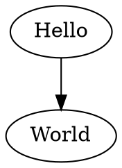

[](https://github.com/ts-graphviz/prettier-plugin-dot/actions?workflow=NodeCI)
[](https://badge.fury.io/js/prettier-plugin-dot)
[](https://opensource.org/licenses/MIT)
[](http://makeapullrequest.com)
[](https://github.com/facebook/jest)
[](https://github.com/prettier/prettier)<!-- ALL-CONTRIBUTORS-BADGE:START - Do not remove or modify this section -->
[](#contributors)
<!-- ALL-CONTRIBUTORS-BADGE:END -->

# Prettier for Graphviz Dot

prettier-plugin-dot is a prettier plugin for Graphviz Dot.

Format your Dot using Prettier.

## How it works? 🤔

A Prettier plugin must first parse the source code of the target language into a traversable data structure (Usually an **A**bstract **S**yntax **T**ree)
and then print out that data structure in a "pretty" style.

The Graphviz Dot AST generated by [ts-graphviz](https://github.com/ts-graphviz/ts-graphviz) implemented in JavaScript using the [peggy](https://github.com/peggyjs/peggy).
What this means is that unlike many other prettier plugins, prettier-plugin-dot has no additional runtime pre-requisites (e.g: Python executable). It could even be used inside a browser.

## Getting started ✨

If you're using the npm or yarn CLI, then add the plugin by:

[](https://nodei.co/npm/prettier-plugin-dot/)

```bash
# yarn
$ yarn add -D prettier prettier-plugin-dot
# or npm
$ npm install --save-dev prettier prettier-plugin-dot
```

The prettier executable is now installed and ready for use:

```bash
$ yarn run prettier --write '**/*.dot'
# or
$ npx prettier --write '**/*.dot'
```

## Example 📑

### Input ⬅️



### Output ➡️


## Related Projects 💫

Related projects can be found at [**ts-graphviz** GitHub Organization](https://github.com/ts-graphviz).

The TypeScript/JavaScript ecosystem provides a variety of OSS with the goal of making Graphviz more connected and easier to use.

## Contributors 👥

Thanks goes to these wonderful people ([emoji key](https://allcontributors.org/docs/en/emoji-key)):

<!-- ALL-CONTRIBUTORS-LIST:START - Do not remove or modify this section -->
<!-- prettier-ignore-start -->
<!-- markdownlint-disable -->
<table>
  <tbody>
    <tr>
      <td align="center" valign="top" width="14.28%"><a href="http://blog.kamiazya.tech/"><br /><sub><b>Yuki Yamazaki</b></sub></a><br /><a href="https://github.com/ts-graphviz/prettier-plugin-dot/commits?author=kamiazya" title="Documentation">📖</a> <a href="https://github.com/ts-graphviz/prettier-plugin-dot/commits?author=kamiazya" title="Tests">⚠️</a> <a href="https://github.com/ts-graphviz/prettier-plugin-dot/commits?author=kamiazya" title="Code">💻</a></td>
      <td align="center" valign="top" width="14.28%"><a href="https://thewilkybarkid.dev"><br /><sub><b>Chris Wilkinson</b></sub></a><br /><a href="https://github.com/ts-graphviz/prettier-plugin-dot/issues?q=author%3Athewilkybarkid" title="Bug reports">🐛</a></td>
      <td align="center" valign="top" width="14.28%"><a href="http://safareli.github.io/resume/"><br /><sub><b>Irakli Safareli</b></sub></a><br /><a href="#ideas-safareli" title="Ideas, Planning, & Feedback">🤔</a></td>
      <td align="center" valign="top" width="14.28%"><a href="https://github.com/thought2"><br /><sub><b>Michael Bock</b></sub></a><br /><a href="https://github.com/ts-graphviz/prettier-plugin-dot/issues?q=author%3Athought2" title="Bug reports">🐛</a></td>
    </tr>
  </tbody>
</table>

<!-- markdownlint-restore -->
<!-- prettier-ignore-end -->

<!-- ALL-CONTRIBUTORS-LIST:END -->

This project follows the [all-contributors](https://github.com/all-contributors/all-contributors) specification. Contributions of any kind welcome!

## How to Contribute 💪

The easiest way to contribute is to use the library and star [repository](https://github.com/ts-graphviz/prettier-plugin-dot).

### Questions 💭

Feel free to ask questions on [GitHub Discussions](https://github.com/ts-graphviz/prettier-plugin-dot/discussions).

### Report bugs / request additional features 💡

Please register at [GitHub Issues](https://github.com/ts-graphviz/prettier-plugin-dot/issues/new/choose).

### Development / Bug Fixes 🧑‍💻

See [CONTRIBUTING.md](https://github.com/ts-graphviz/prettier-plugin-dot/blob/main/CONTRIBUTING.md).

### Financial Support 💸

Please support core member [kamiazya](https://github.com/sponsors/kamiazya).

> **Note** Even just a dollar is enough motivation for me to develop 😊

## License ⚖️

This software is released under the MIT License, see [LICENSE](./LICENSE).
